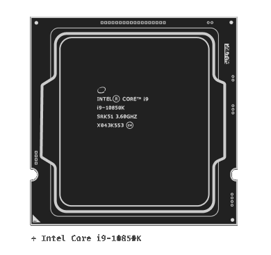

<h3 align="center">
	 
	
	Computer Architecture
	
</h3> 

	
	

&nbsp;

A study on VHDL: VHSIC (Very High Speed Integrated Circuit) Hardware Description Language for classroom material.

&nbsp;
### ❤️ Contributors

Thanks for making this project possible:

|  | <a href="https://github.com/ITSURENXD">Saugat Tamang</a> |
|----------------|----------------|

&nbsp;
### 📜 License

Get Closest is released under the [MIT license](./LICENSE), which grants the following permissions:

- Commercial use
- Distribution
- Modification
- Private use

&nbsp;

